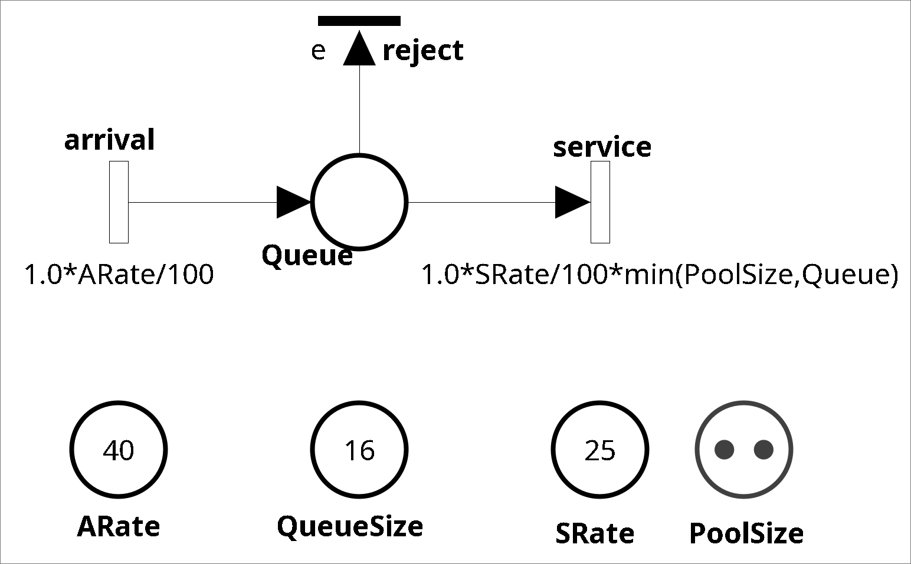
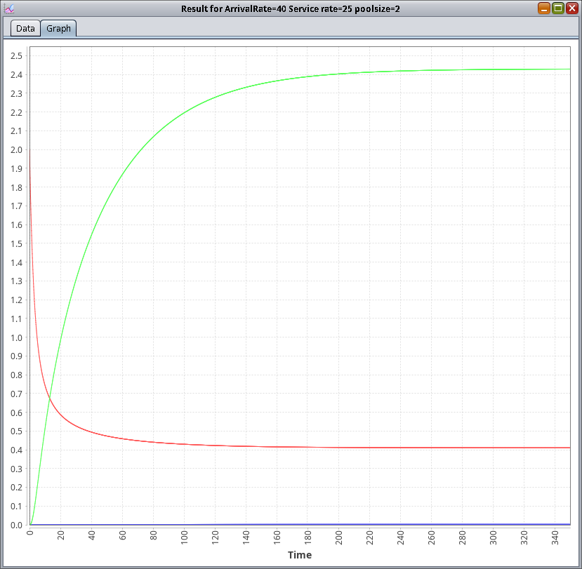
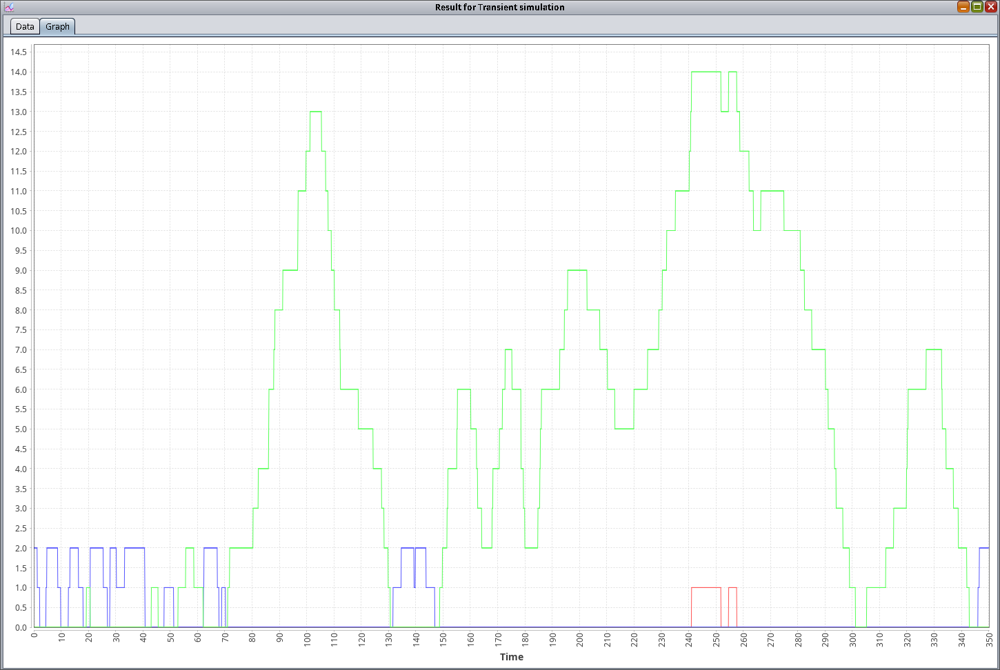
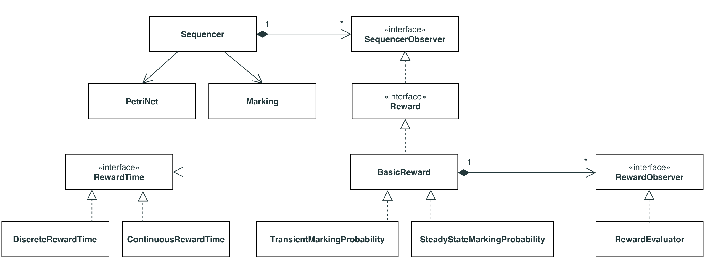
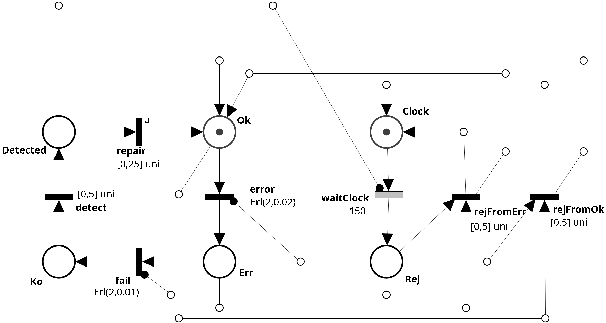
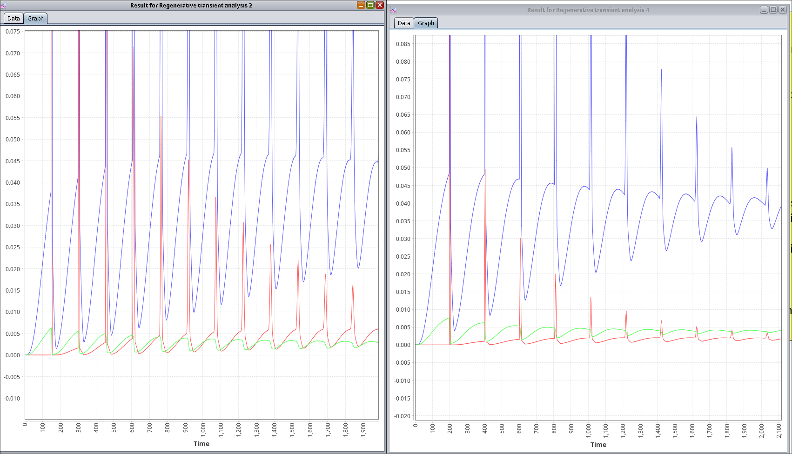
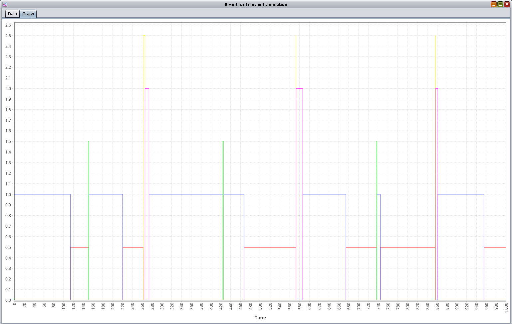
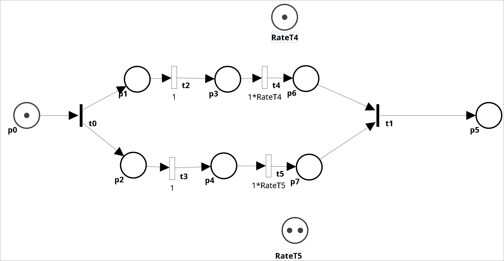
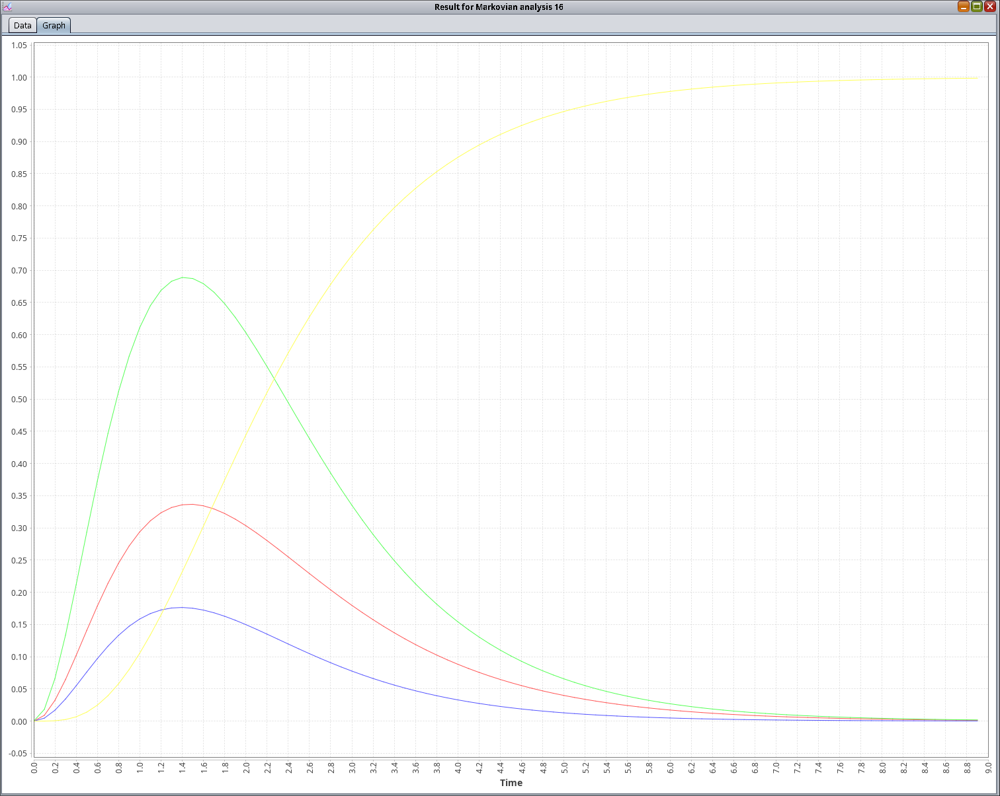

All the xpn models are contained in the `pn-models` directory.

## GSPN In Oris



1. Open the model `simple-gspn.xpn` with Oris.


### rewards of interest

1. *If(Queue>PoolSize,Queue-PoolSize,0)* -> The expected number of queued requests
2. *If(Queue==QueueSize,1*ARate/(100),0)* -> The rejection rate
3. *If(Queue<PoolSize, PoolSize-Queue,0)* -> The mean number of unused resources

**Reward String**: If(Queue>PoolSize,Queue-PoolSize,0);If(Queue==QueueSize,1*ARate/(100),0);If(Queue<PoolSize, PoolSize-Queue,0)

### Transient Analysis of GSPN
1. *Time Limit*: 350
2. *Discretization Step*: 0.1




* **Blue Line**: Rejection Rate 
* **Red Line**: Queued Request 
* **Green Line**: Resource Unusage


### Steady State Analysis of the GSPN


| Reward | Meaning          |         Value         |
| :--- |:-----------------|:---------------------:|
|If(Queue<PoolSize, PoolSize-Queue,0)| Queued Requests  | 	0.410  |
|If(Queue==QueueSize,1*ARate/(100),0)| Rejection Rate   | 	0.002 |
|If(Queue>PoolSize,Queue-PoolSize,0)| Resource Unusage |  	2.429  |


### Model Simulation

Select just **1 run**.

Simulation Rewards:
1. *If(Queue>PoolSize,Queue-PoolSize,0)* -> Number of queued requests
2. *If(Queue==QueueSize,1,0)* -> Full Queue
3. *If(Queue<PoolSize, PoolSize-Queue,0)* -> Number of unused resources

**Reward String**: If(Queue>PoolSize,Queue-PoolSize,0);If(Queue==QueueSize,1,0);If(Queue<PoolSize, PoolSize-Queue,0)



**Green Line**: Queued Request
**Red Line**: Full Queue
**Blue Line**: Resource Unusage


## GSPN in Sirio

Export the GSPN from Oris as a Java Source

The result will be very similar to the one found in GSPNOrisOriginal.java, excluding the main method.
### Reward Rate

To express a reward in Oris, you need to use the RewardRate class.
```Java
RewardRate myReward = RewardRate.fromString("Place1+Place2");
```

### Transient analysis of GSPN

To perform a transient analysis, use the builder provided by the `GSPNTransient` engine.

Example:
```Java
double step = 0.1; // the discretization step
double limit = 350.0; // the time limit

Pair<Map<Marking, Integer>, double[][]> result = GSPNTransient.builder()
        .timePoints(0.0, limit , step)
        .build() // returns the GSPNTransient instance
        .compute(net, marking); // Runs the analysis of a given petri net with an initial marking
```

The available options for the builder are:

| Option                          | Descrition                            | Default |
|:--------------------------------|:--------------------------------------|:-------:|
| `.timePoints(start, end, step)` | Uniform Grid                          |    -    |
| `.timePoints(double[])          | Array of exact time points`           |    -    |
| `.error(double)`                | Fox-Glynn error (for each time point) |  1e-6   | 
| `.epsilon(double)`              | Threshold used to approximate to zero |  1e-9   | 
| `.stopOn(...)`                  | Stopping criterion                    | never   | 

#### Extracting the transient result from the analysis

The `.compute(n, m)` method of `GSPNTransient` returns the probability distribution over the marking `m` of the Petri net `n` in the form of a `Pair<Map<Marking,Integer>, double[][]>`.

The first element of the pair, `Map<Marking,Integer>`, provides a mapping between the marking and its column position within the double array returned as the second element of the pair.
The second element of the pair, `double[][]`, is a two-dimensional array that has as many rows as there are time points and as many columns as there are markings.
Each coordinate `(t, m)` of the array therefore identifies the probability of being in marking `m` at a given time `t`.

Once the computation result is obtained, it is sufficient to calculate the reward value for each time point and multiply it by the marking's probability.
The expected transient reward is given by the accumulation of this value over time.

```Java
Map<Marking, Integer> statePos = result.first();   // marking -> column index
double[][] probs = result.second();                // probs[t][stateIndex]

int numTimePoints = probs.length;

double[] reward1Values = new double[numTimePoints]; // the array of transient values to be populated
double[] reward2Values = new double[numTimePoints];
// Others ...

double currentTime = 0.0;
for (int t = 0; t < numTimePoints; t++) {

    // Iterate over all markings
    for (Map.Entry<Marking, Integer> entry : statePos.entrySet()) {
        Marking m = entry.getKey();
        int stateIndex = entry.getValue();

        // Probability of being in marking m at time t
        double prob = probs[t][stateIndex];

        // Evaluate the reward with the given time and marking
        double r1Val = reward1.evaluate(currentTime, m); // RewardRate instance required
        double r2Val = reward2.evaluate(currentTime, m);

        // Accumulate (Prob * Reward value)
        reward1Values[t] += prob * r1Val;
        reward2Values[t] += prob * r2Val;
    }
    // Time update
    currentTime += step;
}
```

## Simulation



In the simulation, there are 3 main actors linked by an observer-observable mechanism:
1. `Sequencer`: acts as the engine for the Discrete Event Simulator.
2. `TransientMarkingConditionProbability`: an evaluator of the reward condition.
3. `RewardEvaluator`: handles the number of runs.

### `Sequencer`

Generates a single trajectory in the net, starting from an initial marking and simulating up to a certain time limit.
It relies on `STPNSimulatorComponentsFactory` to correctly sample the distributions present in the net.

```java
 public enum SequencerEvent {
        RUN_START,
        RUN_END,
        FIRING_EXECUTED,
        SIMULATION_START,
        SIMULATION_END
    }
```

To instantiate it, follow this approach:
```java
Sequencer s = new Sequencer(
    this.net,
    this.marking,
    new STPNSimulatorComponentsFactory(),
    new AnalysisLogger() { ... }   // Logger Def
    );
```

It provides the `simulate()` method which, by relying on `RewardEvaluator`, allows determining how many runs to execute.

### `TransientMarkingConditionProbability`

It is an Observer of `Sequencer`.
It acts as a Reward since, at each event, it evaluates whether the MarkingCondition is verified in the current marking, if so, it accumulates 1.0 in the current time slot.
After all runs have been executed, each time slot contains the relative frequency, which allows estimating the transient probability.

```java
TransientMarkingConditionProbability reward =
    new TransientMarkingConditionProbability(
    s,                                          // observes the Sequencer
    new ContinuousRewardTime(timeStep),         // continuous sampling every `step`
    samplesNumber,                              // how many time points
    MarkingCondition.fromString(rewardString)   // e.g., "Queue > 5"
    );
```

### `RewardEvaluator`

Observes the reward (instance of `TransientMarkingConditionProbability`).
Its purpose is to inform the sequencer about how many runs to execute.
When the `simulate()` method is called from the sequencer, the `RewardEvaluator` informs the sequencer of the number of runs to perform.

```java
RewardEvaluator rewardEvaluator = new RewardEvaluator(reward, runsNumber);
```

### Extracting the simulation result

```java
TimeSeriesRewardResult result = (TimeSeriesRewardResult) reward.evaluate();
```
It returns a time series for each marking reached during the simulation.
`result.getMarkings()` gives the set of all visited markings.
`result.getTimeSeries(m)[t]` gives the empirical frequency of marking `m` at time `t`.

Once the result is obtained, it can be converted into a `TransientSolution`, which is the standard format for Sirio.


The `TransientSolution` tensor is a three-dimensional tensor with the following indices `solution[t][0][r]`:

* `t`: time index 
* `0`: regeneration index (we consider the regenerations as a list containing only the initial marking) 
* `r`: reward index

Initially, we create the transient solution tensor by inserting the frequencies obtained from the simulation:
```java
RewardRate rewardRate = RewardRate.fromString(rewardString);
List<Marking> regenerations = new ArrayList<>(Arrays.asList(initialMarking));
List<RewardRate> columnStates = new ArrayList<>();
columnStates.add(rewardRate);

TransientSolution<Marking, RewardRate> solution = new TransientSolution<>(timeLimit, timeStep, regenerations, columnStates, initialMarking);

List<Marking> mrkTmp = new ArrayList<>(result.getMarkings());
TransientSolution<Marking, Marking> tmpSolution = new TransientSolution<>(timeLimit, timeStep, regenerations, mrkTmp, initialMarking);

for (int t = 0; t < tmpSolution.getSolution().length; t++) {
    for (int i = 0; i < mrkTmp.size(); i++) {
        tmpSolution.getSolution()[t][0][i] = result.getTimeSeries(mrkTmp.get(i))[t].doubleValue(); // empirical frequency of marking i at time t
    }
}
```

Finally, using `TransientSolution.computeRewards`, the reward rate is applied to each marking, weighted by the probability estimated from the simulation:

```java
// Evaluate the reward
TransientSolution<Marking, RewardRate> rewardTmpResult = TransientSolution.computeRewards(false, tmpSolution, rewardRate);
for (int t = 0; t < solution.getSolution().length; t++) {
    solution.getSolution()[t][0][columnStates.indexOf(rewardRate)]
        = rewardTmpResult.getSolution()[t][0][0];
}
```


## Simulator beyond Monte Carlo Simulation

Note that while Sirio's discrete-event simulator allows for easy Monte Carlo simulation, its use is not limited to this.
In fact, starting from the specified model, it is possible to generate ground truth data of the system's behavior.

There are several notable examples from past projects where datasets of timestamped time series were generated starting from stochastic models (e.g., students Magnolfi, Pratesi, and Vinchesi).

To obtain datasets of timestamped time series, it is necessary to extend the `SequenceObserver` interface. This is the same interface extended by `Reward`, which allows observing a `Sequencer` and all the events it emits during the execution of sequences.
In particular:
- `RUN_START`: indicates the beginning of a time series
- `RUN_END`: indicates the end of a time series
- `FIRING_EXECUTED`: indicates the firing of a transition

By observing these events, it is possible to react and build each time series.


## Non-Markovian Analysis in Oris


1. Open the model `non-markovian-net.xpn` with Oris.



### Rewards of interest

1. `Ko` -> Unreliability
2. `If(Ko+Detected>0 || Rej>0,1,0)` -> Unavailability
3. `If(Ok>0 && Rej>0,1,0)` -> Unavailability due to unuseful maintenance


**Reward String**: Ko; If(Ko+Detected>0 || Rej>0,1,0); If(Ok>0 && Rej>0,1,0)


### Regenerative Transient Analysis

1. *Time Limit*: 10000
2. *Discretization Step*: 2.5 (maybe too coarse)

Analyze the net twice: once with `waitClock` transition set to 150 and once set to 200 and check the different behavior of Unavailability due to unuseful maintenance and Unreliability.



* **Green Line**: Unreliability 
* **Red Line**: Unavailability due to unuseful maintenance 
* **Blue Line**: Unavailability

### Regenerative Steady State Analysis


WaitClock = 200

| Reward                             | Meaning          |         Value         |
|:-----------------------------------|:-----------------|:---------------------:|
| If(Ko+Detected>0 \|  \| Rej>0,1,0) | Unavailability  | 0.032	|
| If(Ok>0 && Rej>0,1,0)              | Unuseful Maintenance Unavailability   | 0.0012 |
| Ko                                 | Unreliability |  0.0038	|


WaitClock = 150

| Reward                              | Meaning          |         Value         |
|:------------------------------------|:-----------------|:---------------------:|
| If(Ko+Detected>0 \|   \| Rej>0,1,0) | Unavailability  | 0.029	|
| If(Ok>0 && Rej>0,1,0)               | Unuseful Maintenance Unavailability   | 0.0033 |
| Ko                                  | Unreliability |  0.0026	|

### Model Simulation

Select just **1 run**.

Simulation Rewards:
1. Ko
2. Rej
3. Detected
4. Err
5. Ok


**Reward String**: Ko*2.5;Rej*1.5;Detected*2;Err*0.5;Ok

Note that we use a multiplier term just to avoid overlapping curves




## Non-Markovian Analysis in Sirio

Export the STPN from Oris as a Java Source.

The result will be very similar to the one found in the `rejuvenationOriginal.java`.

### Regenerative Transient Analysis

When the underlying stochastic process of a model is not strictly Markovian but finds regenerations (i.e., states where all general timers are newly-enabled or with deterministic enabling time), the RegTransient engine can be used for transient analysis.


This method builds a tree of transient stochastic state classes from each regeneration until the next reachable regeneration. Each node of the tree encodes a marking and the joint PDF of enabled transitions. These are used to compute the global and local kernels of the underlying Markov regenerative process.

In turn, the kernels are used to solve (numerically) Markov renewal equations that provide the transient probability of all markings.

Example:

```Java
RegTransient analysis = RegTransient.builder()
    .timeBound(new BigDecimal("5"))
    .timeStep(new BigDecimal("0.1"))
    .build();

TransientSolution<DeterministicEnablingState, Marking> result =
    analysis.compute(pn, marking);

System.out.println("The transient probabilities at time 1.0:");
for (int j = 0; j < result.getColumnStates().size(); j++) {
    System.out.printf("%1.6f -- %s%n", result.getSolution()[10][0][j],
            result.getColumnStates().get(j));
}
```


The available options for the builder are:

| Option                                | Descrition                                            | Default |
|:--------------------------------------|:------------------------------------------------------|:-------:|
| `timeBound(BigDecimal)`               | Time Limit                                            |    -    |
| `timeStep(BigDecimal)`                | Time Step                                             |    -    |
| `policy(Supplier<EnumerationPolicy>)` | next state selection in the tree                      |  FIFO   | 
| `normalizeKernels(boolean)`           | normalization of the kernels                          |  false  | 
| `.stopOn(...)`                        | Stopping criterion                                    |  never  | 
| `.greedyPolicy(timebound)`     | exclude node reached after a timebound                |  never  | 
| `.greedyPolicy(timebound, error)`     | exclude node reached after a timebound under an error |  never  | 


### Regenerative Steady State Analysis

When the underlyng  stochastic process of a model finds regenerations in a bounded number of discrete events (e.g., within at most 20 transition firings) the `RegSteadyState` can be used for steady state analysis.


This method builds a tree of transient stochastic state classes from each regeneration until the next reachable regeneration. Each node of the tree encodes a marking and the joint PDF of enabled transitions. The DTMC embedded at regeneration points is solved to find equilibrium probabilities of regenerations; these are combined through sojourn times in each marking to compute the final result.

**Note**: the current implementation assumes that the state space is irreducible.

Example
```Java
RegSteadyState analysis = RegSteadyState.builder().build();

SteadyStateSolution<Marking> result = analysis.compute(pn, marking);
Map<Marking, BigDecimal> probs = result.getSteadyState();

System.out.println("Steady-state probabilities:");
for (Marking m : probs.keySet()) {
    System.out.printf("%1.6f -- %s%n", probs.get(m), m);
}
```

## Workflows

1. Open the model `forkJoinOf2Sequences.xpn` with Oris.



### Rewards of interest

1. `p5` -> Cumulative Density Function of completion time
2. `If(p6>0,RateT5,0)+If(p7>0,RateT4,0)` -> Probability Density Function
3. `p7` -> wait time of the lower branch
3. `p6` -> wait time of the higher branch


**Reward String**: If(p6>0,RateT5,0)+If(p7>0,RateT4,0)

### Transient Analysis of GSPN
1. *Time Limit*: 9
2. *Discretization Step*: 0.1




